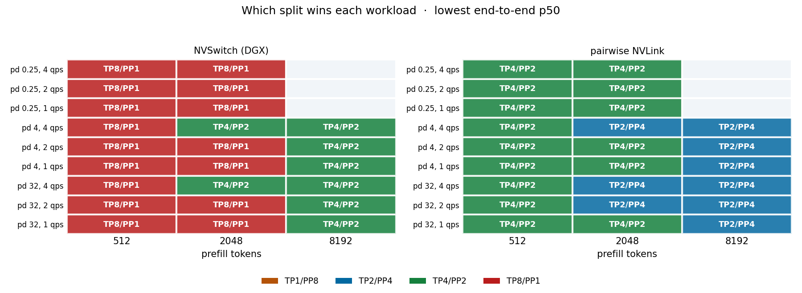
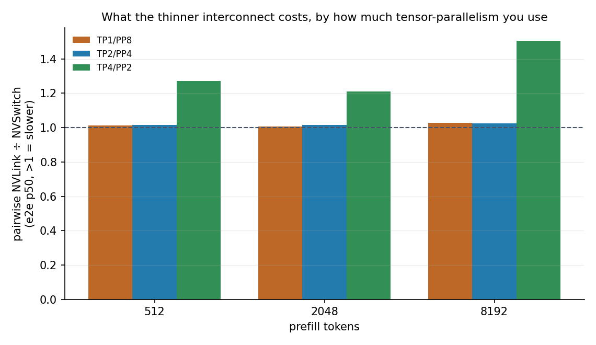
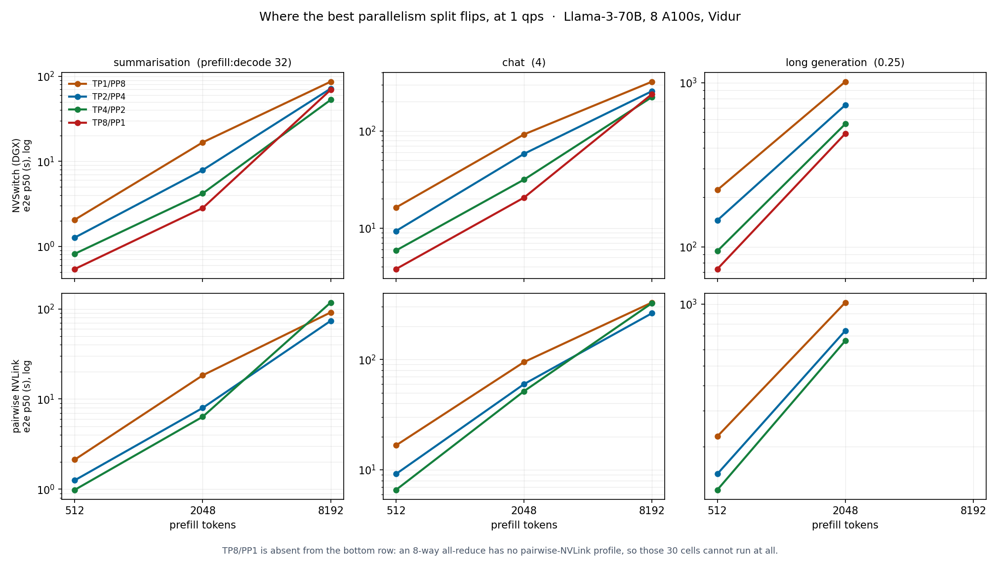

# Where does tensor-parallel stop beating pipeline-parallel?

An 8-GPU budget can be split four ways: TP8/PP1, TP4/PP2, TP2/PP4, TP1/PP8. Everyone
knows the tradeoff in words. Tensor-parallel pays an all-reduce on every layer, so it
wants a fat interconnect. Pipeline-parallel pays bubbles instead, so it wants enough
requests in flight to keep the stages full.

Nobody I could find had drawn the line where one stops winning and the other starts. So
I swept it.

**Setup:** Llama-3-70B on 8 A100s, simulated with
[Vidur](https://github.com/microsoft/vidur) (MLSys'24, Microsoft Research India).
240 cells: 4 parallelism splits x 2 interconnect topologies x 4 context lengths x
3 prefill:decode shapes x 3 arrival rates. 210 ran, 168 are in range and reported here.
No GPUs were used. Vidur predicts execution time from a random forest fitted to
profiling data it ships, which is what makes this runnable on a laptop.

## The result

**The crossover is real, and the interconnect moves it.**

On an NVSwitch fabric, TP8/PP1 wins 16 of 24 workloads. It loses at long context:
TP4/PP2 takes over at prefill 8192 everywhere, and already at 2048 once load reaches
4 qps, for the summarisation and chat shapes. Long generation (pd 0.25) stays with
TP8/PP1 at 2048 even at 4 qps.

Rewire the same 8 GPUs as pairwise NVLink and **the whole crossover shifts one rung
toward pipeline-parallel.** TP4/PP2 now wins the short-context cells that TP8 used to
own, and TP2/PP4 takes 8192.



The right panel is the left panel shifted one colour. That is the finding in one image.

## Why it shifts

Because the thinner fabric only taxes the configs that actually use it.



TP1/PP8 and TP2/PP4 are unchanged, within 3%. A 2-way all-reduce runs over a direct
NVLink pair either way, so the topology is invisible to them. TP4/PP2 pays 27% at
prefill 512, 21% at 2048 and **51% at 8192**, because a 4-way all-reduce on pairwise
NVLink has to route through peers instead of a switch, and the tensor it is reducing
grows with context.

So the mechanism is not "pipeline-parallel got better". It is that tensor-parallel got
more expensive, and it got more expensive fastest where the messages are largest.



## The thing that surprised me

**TP8/PP1 does not run at all on pairwise NVLink.** All 30 of its cells fail with
`Training data for model all_reduce is empty`. That is not a missing measurement,
it is the topology: an 8-way all-reduce needs the NVSwitch fabric, and pairwise NVLink
only wires GPUs in twos.

I nearly missed this. My first pass computed winners pooled across both topologies,
which quietly compared a 4-way field against a 3-way one and produced a cleaner,
wronger answer. Winners are now computed per network. `analyse.py` enforces it.

## What this does not prove

Written out in full in [CAVEATS.md](CAVEATS.md). The short version:

1. **The context axis stops at 8192, not 32768.** Vidur's attention profile for this
   model was measured to 16,320 tokens. Every prefill=16384 cell is extrapolated past
   the fitted range, so all 48 are excluded. The tell is visible in the raw output: TBT
   p99 jumps six-fold at exactly the rung where the forest leaves its training data.
   Extending this axis honestly means profiling the model at longer context, not
   raising the constant.
2. **Every request is the same size.** `fixed` length generator, so there is no
   queueing variance and no head-of-line blocking. That is precisely the thing TP/PP
   choice interacts with in production. This is a clean comparison between parallelism
   configs, not a prediction of production latency.
3. **p99 over 128 requests is barely a p99.** The crossover claim uses p50. Treat every
   p99 here as directional.
4. **It is a simulator.** Vidur is validated by its authors and this is their own tool,
   but no line of this touched real hardware. The obvious next question is whether the
   crossover survives at load/store granularity in something like ASTRA-sim, or on a
   rented A100 node for the handful of cells near the flip.

## Two bugs worth naming

Both were in my own instrument, not in Vidur, and both produced confident numbers.

- **`makespan_s` was null on all 240 rows.** `collect()` read a column called
  `request_completion_time`. Vidur does not emit one. The guard `if rows[0].get(...)
  else None` swallowed it silently. Vidur gives inter-arrival gaps, not absolute
  arrival times, so makespan has to be derived: arrival is the running sum of the gaps,
  completion is arrival plus `request_e2e_time`.
- **12 cells reported a makespan of 0.0 seconds.** They have 128 rows and not one
  finished request: at prefill>=2048 with pd=0.25, generation runs past the simulated
  horizon. The accumulator started at `0.0`, so "nothing completed" came out looking
  like the fastest configuration on the board. It reports `None` now.

## Reproducing

```bash
git clone https://github.com/microsoft/vidur ~/code/vidur   # Python 3.10, uv venv
python3 sweep.py          # ~2 h: four predictor fits, then the grid is seconds per cell
python3 makespan.py       # derive makespan from the run directories
python3 analyse.py        # winner table + figs/
python3 verify.py         # recheck every number in this README against results.jsonl
```

The first run at each tensor-parallel size costs about 11 minutes on 8 cores to fit the
predictor. Every later run at that size is seconds, so the grid is cheap once the four
fits are paid for. `MAX_TOKENS` is part of the predictor cache key, so changing it
discards every fit.

`runs/` (68 MB of per-cell Vidur output) is gitignored. `results.jsonl` and
`makespan.jsonl` are the data, and they are enough to regenerate every figure.
